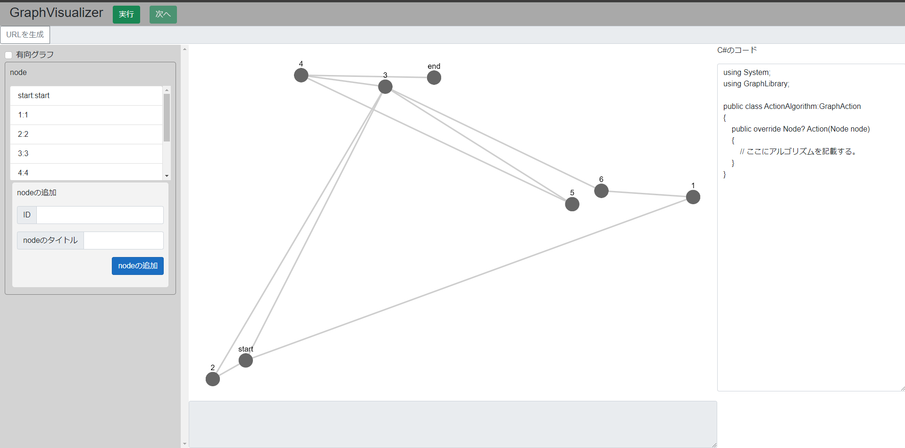
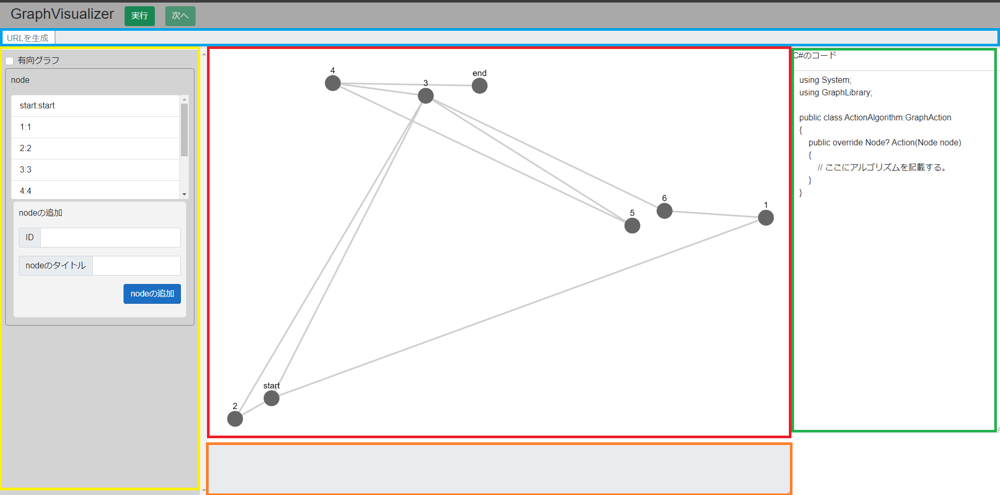
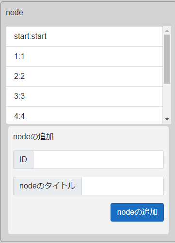
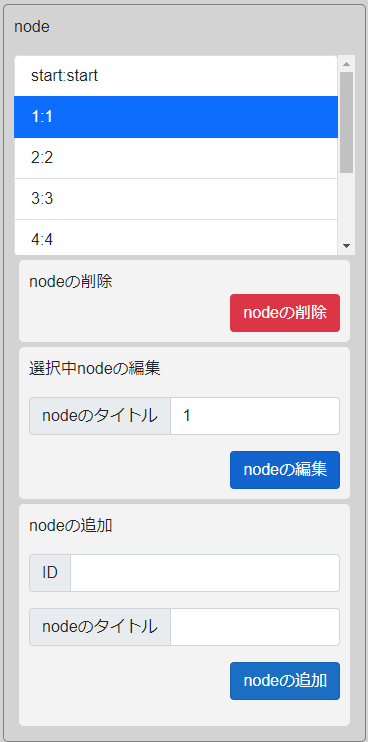
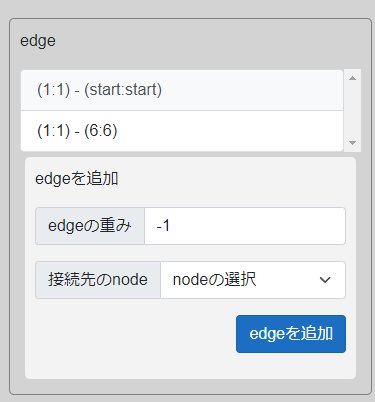
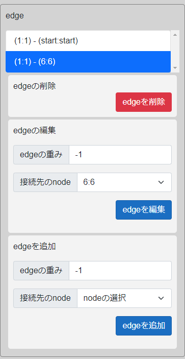

# GraphVisualizer

GraphVisualizerはグラフ理論で用いられるアルゴリズムなどを可視化することができるツールです。

## webサイトを開く

下記リンクよりもWebサイトを開くことができます。

[GraphVisualizer](https://actbit.github.io/GraphVisualizer/)

## 操作方法

サイトを開くと以下のような画面が表示されます。



それぞれの画面構成について説明します。

画面は以下の画像のように分けることができます。



### グラフの描画(赤色の四角)

赤色四角で囲んだ部分にグラフが表示されます。

ノード(頂点)をドラッグアンドドロップで頂点を移動することができます。

### グラフの設定(黄色の四角)

黄色の四角で囲まれた部分でグラフの追加・削除・編集ができます。
以下の有効グラフのチェックボックスにチェックをいれると有効グラフに、チェックを消すと無向グラフになります。


#### nodeの追加・削除・編集

nodeの欄からnodeの追加・削除・編集が行えます。

nodeの欄は以下のようになっています。


リストボックスにはグラフに存在するすべてのnode(頂点)が表示されており、`id:title`の形で表示されています。

##### nodeの追加

nodeの追加の欄にidとnodeのタイトルを入力することでnodeを追加することができます。

##### nodeの選択

リストボックス内のnodeを選択することで以下のように画面の表示が切り替わります。



##### nodeの削除

リストボックス内のnodeを選択後、nodeの削除ボタンを押すことでnodeを削除することができます。
この際nodeにつながるedge(枝・辺)も削除されます。

##### nodeの編集

リストボックス内のnodeを選択後、`選択中のnodeの削除`の欄からnodeのタイトルを編集することができるようになっています。
`ID`は編集することができません


#### edgeの追加・削除・編集

nodeを選択すると以下のようにedgeの選択・追加画面が表示されるようになります。


現在選択中のnodeが`1:1`ですので`id:1`にから移動できるedgeの一覧が表示されます。
有効グラフの場合**相手から自分方向のedgeは表示されません**のでご注意ください。

##### edgeの追加

edgeを追加するには、`edgeを追加`の欄より、`edgeの重み`と`接続先のnode`を選択し、`edgeを追加`ボタンをクリックすることで追加することができます。

重みは-1にしておくことで無効化されます

##### edgeの選択

edgeもnode同様選択することで以下のように画面が切り替わり、編集・削除が行えるようになります。



##### edgeの削除

edgeの削除の欄から`edgeの削除`ボタンを押すことでedgeの削除を行えます。


##### edgeの編集

edgeの編集の欄より重みおよび接続先のnodeの編集を行うことができます。


### プログラムの記述(全画面の緑の四角)

画面説明の緑の四角の部分でグラフの探索を行うためのプログラムを記述することができます。

もし、エラーが発生した場合にはオレンジ色の四角で囲われた部分にエラーが表示されます。

詳しくはAPIの説明にて説明します。

### プログラムの実行

画面上部の`実行`ボタンを押すことでプログラムを実行することができます。
実行が開始すると`次へ`ボタンが有効化されるので、`次へ`ボタンを押すことで次の関数を実行することができるようになっています。

### データの保存

GraphVisualizerはURLにプログラムやノード設定を保存します。
そのためにはURLを生成する必要があります。

URLの生成ボタンを押すことで右側のテキストボックスにURLが生成されるので、そのURLをコピーし、共有してください。

コピーしたURLにアクセスすることでデータが復元されます。


## プログラムの書き方

プログラムの記述方法を説明します。

### プログラムの基本的な考え

GraphVisualizerはC#でプログラムを記述することでアルゴリズムを表示することができるようになっています。

以下のコードは初期状態のプログラムです。

```cs
using System;
using GraphLibrary;

public class ActionAlgorithm:GraphAction
{
    public override Node? Action(Node node)
    {
        // ここにアルゴリズムを記載する。
    }
}
```
#### 関数について
`public class ActionAlgorithm:GraphAction`の部分は`GraphAction`という型を派生した`ActionAlgorithm`という型(クラス)を宣言しています。

```
public override Node? Action(Node node)
{
    // ここにアルゴリズムを記載する。
}
```
の部分で戻り値がNode型、引数がNode型のActionという関数を宣言しています。
このActionという関数は引数にターゲットとなる(注目している)Nodeが与えられます。
戻り値に指定したNodeで次のターゲットとなるNodeを指定することができます。
つまり、戻り値として返したNodeが次のActionの呼び出し時に引数として渡されるようになります。
戻り値をnullとした場合に探索を終了します。


実際の使い方としては探索などの際に次に探索するNodeの決定やデータNodeデータの保存などを行えるようになっています。

以下に深さ優先探索のプログラムの例を示します。
```cs
using System;
using GraphLibrary;
using System.Collections.Generic;
public class ActionAlgorithm:GraphAction
{
    // Nodeのスタックを作成
    Stack<Node> NodeStack = new Stack<Node>();
    public override Node? Action(Node node)
    {
        node.IsVisited = true; // 探索済みにする
        // nodeの色を変える
        node.Color = "red";
        if(node.ID == "end") // endを探す
        {
            Print("endを発見しました");
            return null;
        }
        // 次のnodeを入れる変数
        Node? nextNode = null;
        // nodeから移動できるedge一覧を取得
        var edges = node.ToEdges;
        // edge一覧をループで確認
        for(int i = 0;i< edges.Count;i++)
        {
            // edgeにつながるnodeが訪問済みか確認
            if(edges[i].ToNode.IsVisited == false)
            {
                //訪問済みではない場合

                // 次のnodeに設定
                nextNode = edges[i].ToNode;
                // edgeの色を変える
                edges[i].Color = "blue";
                // ループを抜ける
                break;
            }
        }

        // 次のnodeがあるか確認
        if(nextNode  == null)
        {
            // スタックの中身が0個か確認
            if(NodeStack.Count == 0)
            {
                // 見つからなかったので探索を終了する。
                Print("接続されていません");
                // nullを返すと探索終了
                return null;
            }
            // Stackからpopして次のnodeに設定
            nextNode = NodeStack.Pop();
        }
        else
        {
            // 現在のnodeをスタックにpush
            NodeStack.Push(node);
        }

        // nextNodeを返してメソッド終了
        return nextNode ;
    }
}
```

このプログラムは以下のリンクより実行可能です
[深さ優先探索のサンプルプログラム](https://actbit.github.io/GraphVisualizer/?code=KLUv_QBY9BoAtmiOQxCrOgdIciIAAABg~48sZtV5FRum4cwHfcPVVVF8_tr11g5wULG7smkzRrevuVch05TjEFaG5VUDok7x0RcRAAACBwF9AHgAfwCiDe2BsMCmuzXVu2BX73IyAqpnMa4bl9NkFFSwuw5QvcuRyPh0xAuREkry4cXMr5KfJN8lP4f8Mf_qXU5vW3e3xkADoCESLb6hb2Kiw7DzffpjP8840riPxRWsFZsQvFb81O~7FBuN48Ad7LEGRKMOrtA4jSqGHBcdAm04Bp24oIIYUKiJdZb5T_lPGpxmjvmbXEBJ3zeCDeJRrJjTYEpa_FP~ZSuVqWaYjAhabNHdrfJfgaBmfg~svW2twXhgxXTX9YAMyHIYr2JMd43vdylK_ibWaebPYEpj_ttW5lf5w_xd_Ess6GpltgJBe9uaqyMWu2uvBqiZMXX8PNxI7Ex5pTDXSiLnSoXTQ8Xfpanh1wF1x7kYmwQWQRmCOlFe6anMf_JH8WdpICAsJ4LjpdhIWC6iu7YtgjaDL~gDJZWtZi7_FPkeyIeRH9aQR~BidB3WkFcbdzZSLeeEkNPM72qlHSwvNeTVMv~Hv8sfVZ4dXDNT_jIkjdTdrXEm8knyP~Q3Ib_ln9o2UTiKwnEEe5GcLSGzGn5Vkxldi9bojl7~Kn8JLqmZ__vGCPkpePi3_E_5Uf4jG2YnIGjueAeyl6xhZuZ3~cf8S_wt~Jesjuiu67LjjDj5w2RpCstLzLvOgGyZP_ufNFJGp2IPBH~SBwF2qIGVUQiZIRESmU2l2CACQgxjdT0RlCyEIDJKEclIU1CQbIwB4Q9O~gJ61~HdCgZb5bJOpjBtgAXWGh~cGdjGoAGWIVBYh2o4pSqMZJM1aIDRjEP5MMTm~ZQ91txaW9lg2wNyMZA4jaAC6XqInA97yXVtrGZPP2ODSYnWrySR4An0eFaVfnyqc0d_YRMoSMXaUCKq~9ouzPKMwzv9c9k1J4ZxWURSgW0RpIr38mY1escSWz64DkzQHr8pBVbhmUy2NkrAnenuPIupgVXx1imfw0dsRid8hjLe_Qi~Ua6bqFAaJj6ht1ZeIwdGYixxowWHXccQEL__H3VlV67uO709rqNHePAO5gDdyiogJ5XVl05fEII~j9gGqC4Ml1~CE3A5Aw--&graph=KLUv_QBYHA0A5l1PHmBp2gFqOOy_9sJBUqTfYWhgyQTZDlfar9ENBMFZAVEARgBBAGT7dC2T6bl2qdr6eBrnKvP7_91PvAA5GHyCUj0nE9GYu0MDUVUAgiCMBcLCFcKhOMiBHIw~GgRBXkEYChCkoX4xQA6qgdALQQ5XDEXAgoAwBNeWemknoWPu6wueQaPHv4q3rNLUYzJvTbs7Z~j8eTVt~L_X8ctebuuUNkyalvjdPBWpW~5OEOQ4SCjUwqESjD6cobBokEPdfegtvbBtyrR0yxiX5Jg4TypmV5q~yZcx3po5mbYL1ZYf8tIq389q6hd0Q~fJ0npa~yfT83vQLyJefYUfraOlDg0Ge05p0yZxoR30tuROWy5q3YyKadXoq2Pmnq9hOcmwL~3z3z7VIKTul4sj5lO~lrgka9Y0XF0zS3XyJr3FlB0tqJF8AYkomriJdQcAw6laBxFIECPktMAIP26iyUzoHOgA2mfwcdlHKtrepdnMMDknI3PMyGlPHV6tRsgDmIEOIaaOpHYwHUmguDOtU0lLbr6JCEvAmTD1YgLpaVcQj_ozwCo-)


### GraphActionクラス

GraphActionクラスはグラフに何かの動作をさせるクラスを作成するのに使用される基底クラスです。
GraphActionから派生したクラスでグラフの動作を実装します。

#### 定義
```cs
public abstract class GraphAction:Object
```

#### 変数

このクラスには変数は含まれません。

#### 関数

|関数名|用途|
|------|----|
|Node? Action(Node)|前述したようにoverrideして実行したいアルゴリズムを記述するためのメソッドです|
|void Print(string)|文字列を引数に与えることで値を表示することができます。|

### Nodeクラス

NodeクラスはNodeの情報を管理するためのクラスです。

#### 定義

```cs
public class Node:object
```

#### static変数(プロパティ)

|変数名|型|用途|
|-----|---|---|
|Nodes|IReadOnlyList<Node>|node一覧を変更不可能なリストで保存する変数(プロパティ)です|
|Edges|IReadOnlyList<Edge>|edge一覧を変更不可能なリストで保存する変数(プロパティ)です|

#### 変数(プロパティ)

|変数名|型|用途|
|-----|---|---|
|ToEdges|IReadOnlyList<ToEdge>|現在のNodeから到達可能なEdge一覧を変更不可能なリストで保存できる変数(プロパティです)|
|IsVisited|bool|到達可能かを保存できる変数です。実行開始時にデフォルト(false)に戻されます(初期化処理不要)|
|State|int|状態を保存するための変数です。実行開始時にデフォルト(0)に戻されます(初期化処理不要)|
|ID|string|NodeのIDを取得できます。設定はできません|
|Title|string|Nodeのタイトルを取得・編集できます|
|Color|string|色を変更取得・編集できます|

#### staticメソッド(関数)

|関数名|用途|
|------|---|
|Node Create(string id, string title)|Nodeを新規作成します。|
|Node Create(string id)|Nodeをタイトルの指定なしで新規作成します。|
|bool ContainsID(string id)|引数のidを持つNodeがあるかを確認します。|
#### メソッド(関数)

|関数名|用途|
|---|----|
|void Delete()|現在のnodeを削除します。接続しているEdgeも削除されます。|
|void CreateToEdge(Node node,int weight)|現在のNodeから引数のnodeへのedgeをweightを指定して作成します。|


### ToEdgeクラス

ToEdgeクラスはNodeから移動可能なEdgeを表すためのクラスです。

#### 定義

```cs
public class ToEdge:object
```

#### 変数

|変数名|型|用途|
|-----|---|----|
|ID|string|EdgeのIDを取得できます(変更不可)|
|Weigth|int|重みを取得・編集できます(-1もしくはnullにすると無効化します)|
|Color|string|色を取得・編集できます|
|ToNode|string|ToEdgeの取得元のNodeからつながるNodeを取得・編集できます|

#### メソッド

|関数名|用途|
|---|----|
|void Delete()|現在のedgeを削除します。|

<hr>


## 使用ライブラリ

- [cytoscape.js](https://github.com/cytoscape/cytoscape.js)
    ```
    Copyright (c) 2016-2024, The Cytoscape Consortium.

    Permission is hereby granted, free of charge, to any person obtaining a copy of
    this software and associated documentation files (the “Software”), to deal in
    the Software without restriction, including without limitation the rights to
    use, copy, modify, merge, publish, distribute, sublicense, and/or sell copies
    of the Software, and to permit persons to whom the Software is furnished to do
    so, subject to the following conditions:

    The above copyright notice and this permission notice shall be included in all
    copies or substantial portions of the Software.

    THE SOFTWARE IS PROVIDED “AS IS”, WITHOUT WARRANTY OF ANY KIND, EXPRESS OR
    IMPLIED, INCLUDING BUT NOT LIMITED TO THE WARRANTIES OF MERCHANTABILITY,
    FITNESS FOR A PARTICULAR PURPOSE AND NONINFRINGEMENT. IN NO EVENT SHALL THE
    AUTHORS OR COPYRIGHT HOLDERS BE LIABLE FOR ANY CLAIM, DAMAGES OR OTHER
    LIABILITY, WHETHER IN AN ACTION OF CONTRACT, TORT OR OTHERWISE, ARISING FROM,
    OUT OF OR IN CONNECTION WITH THE SOFTWARE OR THE USE OR OTHER DEALINGS IN THE
    SOFTWARE.
    ```